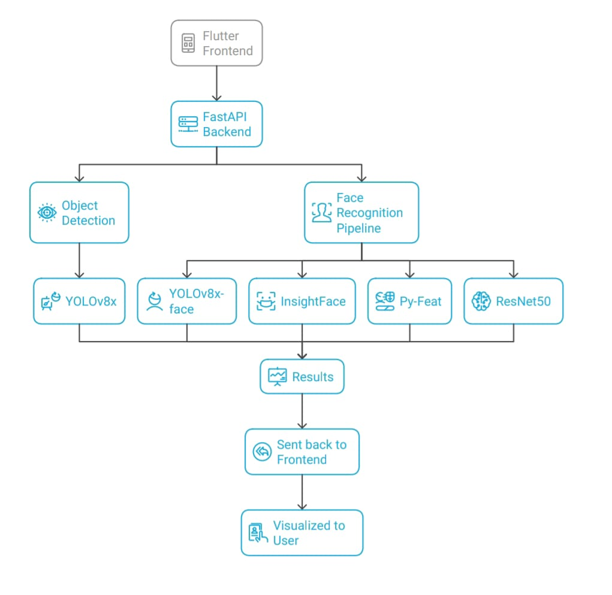
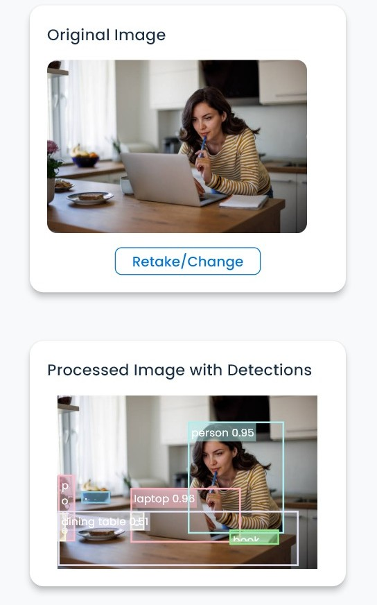
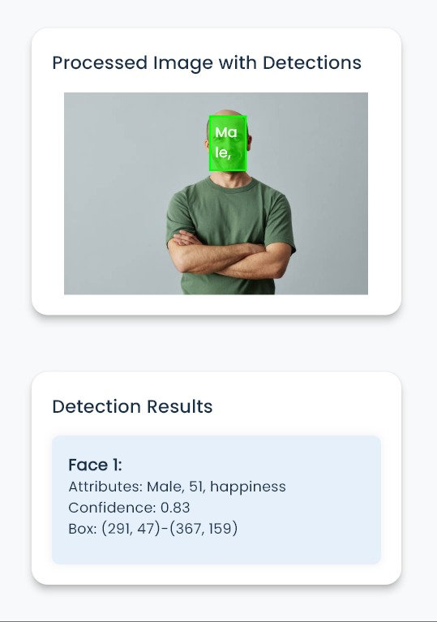

# YOLOFusion 👁️  

<p align="center">
  
</p>

<!-- <h1 align="center">YOLOFusion Project</h1> -->

[](LICENSE)


---

## 📝 Overview  
*YOLOFusion* is an advanced computer vision platform that integrates *YOLOv8* with other state-of-the-art models to deliver *real-time object detection, face recognition, emotion analysis, and age prediction*.  

It features a *Flutter frontend* for cross-platform support (Android, iOS, Desktop) and a *FastAPI backend* for efficient model inference and streaming.  
This project is designed to be *research-grade, production-ready, and extensible*.  
<h2 align="center">Architecture Diagram</h2>
<p align="center">
  
</p>

---

## ✨ Features  

- *🔍 Object Detection* → Detect and classify 80+ objects in real-time with *YOLOv8x*.  
- *👤 Face Recognition* → Identify faces with embeddings & predict attributes (gender, age, emotion).  
- *⚡ Real-Time Streaming* → Low-latency detection with *WebSocket* support.  
- *📱 Cross-Platform* → Single Flutter app for Android, iOS, and Desktop.  
- *🎨 Modern UI* → Animated, responsive, and intuitive user interface.  
- *📊 Analytics Ready* → Extendable for logging detections & visualizing insights.  

Example Outputs:  
## Example Outputs  

<h2 align="center">Detections</h2>

<p align="center">
  <table>
    <tr>
      <td align="center">
        <br>
        <b>Object Detection</b>
      </td>
      <td align="center">
        <br>
        <b>Face Recognition</b>
      </td>
    </tr>
  </table>
</p>

---

## 🏗 Architecture  

1. *Frontend (Flutter)*  
   - Handles user authentication, media uploads, and results visualization.  
   - Communicates with backend via *REST API + WebSocket*.  

2. *Backend (FastAPI)*  
   - Runs pretrained models (YOLOv8, InsightFace, ResNet50, Py-Feat).  
   - Provides detection results in JSON format.  
   - Supports real-time video streaming inference.  

3. *Models Used*  
   - *YOLOv8x* (Ultralytics) → Object detection (COCO dataset, 80 classes).  
   - *YOLOv8-face* → Face detection (bounding boxes).  
   - *InsightFace* → Face embeddings & recognition (ArcFace-based).  
   - *ResNet50* → Custom model for age prediction.  
   - *Py-Feat* → Emotion recognition (Ekman’s six universal emotions).  

---

## 📊 Benchmarks & Performance  

| Task              | Model          | Accuracy (Top-1) | FPS (GPU) | FPS (CPU) |
|-------------------|----------------|------------------|-----------|-----------|
| Object Detection  | YOLOv8x        | 52.9 mAP (COCO) | ~45 FPS   | ~7 FPS    |
| Face Recognition  | InsightFace    | 99.8% (LFW)     | ~60 FPS   | ~12 FPS   |
| Emotion Detection | Py-Feat (FER+) | ~85%            | ~30 FPS   | ~5 FPS    |
| Age Prediction    | ResNet50       | ~88%            | ~40 FPS   | ~6 FPS    |

Performance tested on GTX 1660 Ti & Intel i5 CPU (8GB RAM). Results vary by hardware.  

---

## ⚙ Prerequisites  

### *Frontend (Flutter)*  
- Flutter SDK (>=3.0.0)  
- Dart (>=2.17.0)  
- Android Studio

### *Backend (Python)*  
- Python (>=3.8)  
- [FastAPI](https://fastapi.tiangolo.com/), [Uvicorn](https://www.uvicorn.org/)  
- [PyTorch](https://pytorch.org/), [TensorFlow](https://www.tensorflow.org/)  
- [Ultralytics YOLO](https://github.com/ultralytics/ultralytics)  
- [InsightFace](https://github.com/deepinsight/insightface), [Py-Feat](https://py-feat.org/)  
- Visual Studio Code 

---

## 🔧 Installation  

### Clone the Repository  
```bash
git clone https://github.com/kunjdesai12/YOLOFusion-Project.git
cd YOLOFusion-Project
